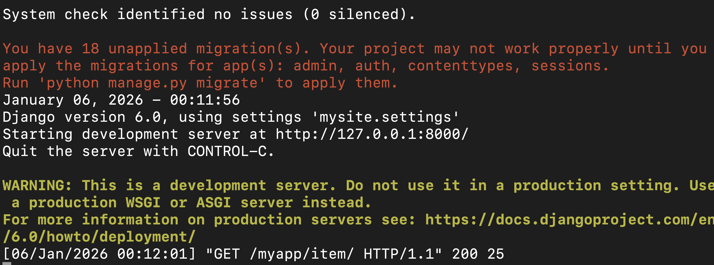

Models in django

To store data, we need to create database and database tables
To create these tables, we need to use SQL.

Model is a blueprint which is used to create database table

Model is a python class

Models are defined in the models.py file

Unapplied Migrations - Simply means that the database tables which are required for these following apps are not yet created

Fresh Django Project

cd ~/projects/myproject
python3 -m venv env
source env/bin/activate
python3 -m pip install --upgrade pip
pip install django
django-admin startproject projectname
cd projectname
python3 manage.py runserver

Django Project Cloned from GitHub

git clone https://github.com/username/repo-name.git
cd repo-name
python3 -m venv env
source env/bin/activate
python3 -m pip install --upgrade pip
pip install -r requirements.txt
python3 manage.py migrate
python3 manage.py runserver

